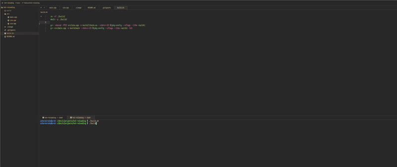

# Hot Reloading in C++ Using Raylib Particle Simulation



For manually reloading the variables in `src/sim.cpp` run

```cpp
 g++ -shared -fPIC src/sim.cpp -o build/libsim.so --std=c++23 $(pkg-config --cflags --libs raylib)
```
